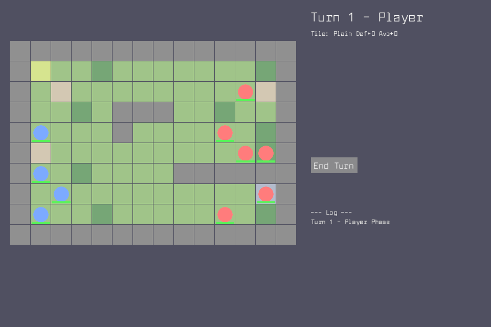
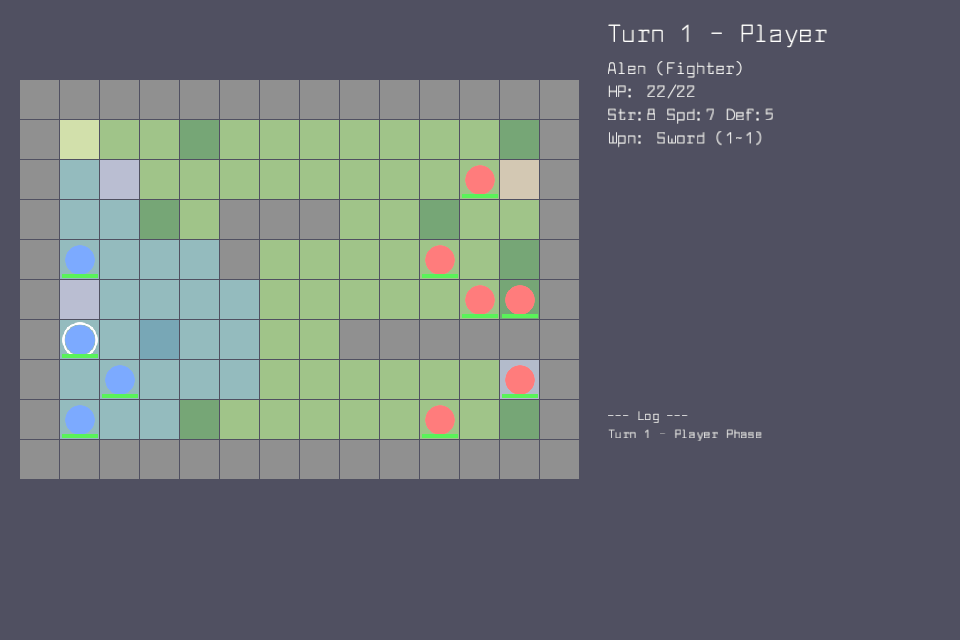
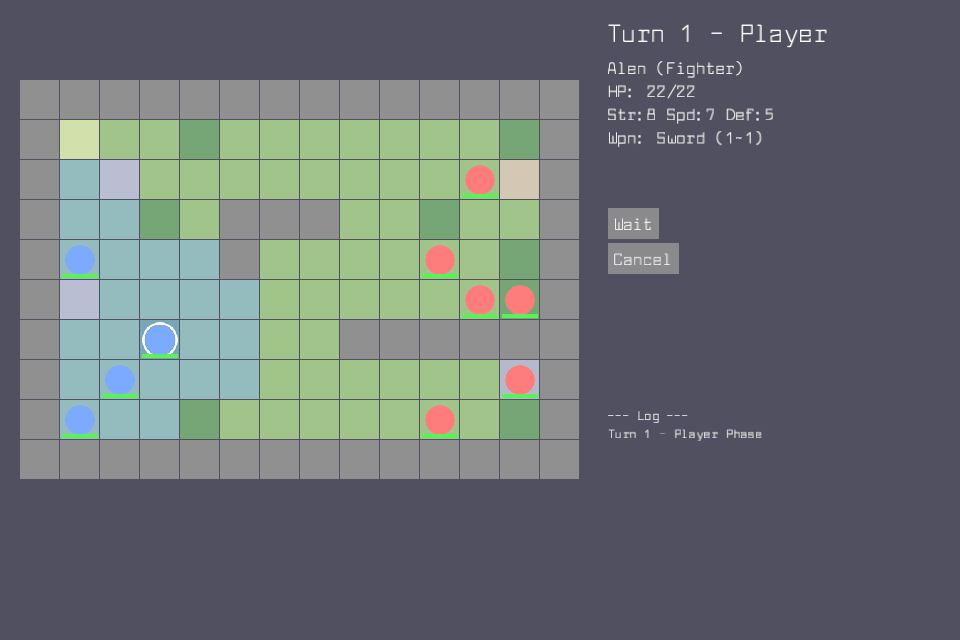
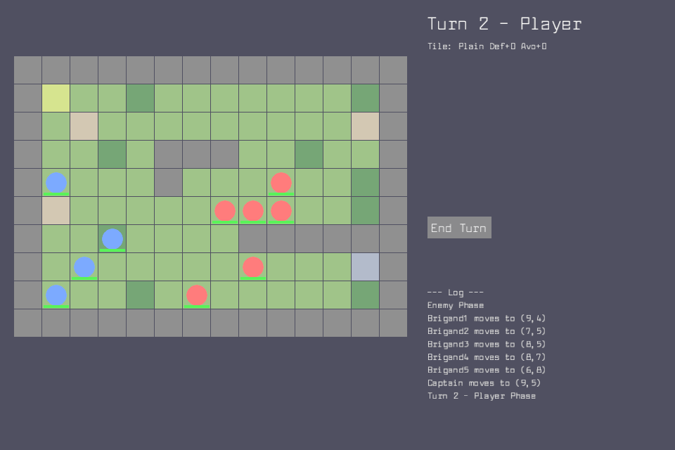

# tactics-demo

A minimal Fire Emblem–style turn-based tactics game built with Vibe2D.

## Screenshots

| Initial state | Unit selected (movement range) |
|---|---|
|  |  |

| Action menu (after moving) | After enemy phase |
|---|---|
|  |  |

## Running

```bash
cargo run -p tactics-demo
```

## Gameplay

- **Blue circles** = player units (Alen/Bram/Clara/Dania)
- **Red circles** = enemy units (Brigands + Captain)
- **Blue-tinted tiles** = movement range when a unit is selected
- **Red-tinted tiles** = attackable enemy positions
- **Yellow tile** = cursor

### Controls

| Key | Action |
|-----|--------|
| Left click | Select unit / Move / Attack |
| Right click / Escape | Cancel |
| E | End turn |

### Phase flow

```
PlayerSelect → PlayerMove → PlayerAction → PlayerAttackTarget
     ↑                                            |
     └────────────── EnemyTurn ←──────────────────┘
```

### Victory / Defeat

- **Victory**: all enemy units defeated
- **Defeat**: all player units defeated

## Map

14×10 grid with 5 terrain types:

| Tile | Color | Move Cost | Def Bonus | Avoid Bonus |
|------|-------|-----------|-----------|-------------|
| Plain | Green | 1 | 0 | 0 |
| Road | Tan | 1 | 0 | 10 |
| Forest | Dark green | 2 | 1 | 20 |
| Fort | Blue-gray | 1 | 2 | 30 |
| Wall | Gray | impassable | — | — |

## Testing

```bash
# Unit tests (22 tests — pure logic, no GPU required)
cargo test -p tactics-demo

# VDP integration tests (requires GPU/display)
cargo test -p tactics-demo -- --ignored --test-threads=1
```

## VDP Methods

| Method | Class | Description |
|--------|-------|-------------|
| `game.inspect` | Inspect | Full game state as JSON |
| `game.selectUnit` | Flow | Select a player unit by id |
| `game.moveSelected` | Flow | Move selected unit to `{x,y}` |
| `game.waitSelected` | Flow | End selected unit's turn |
| `game.endTurn` | Flow | End player phase, run enemy AI |
| `game.previewCombat` | Read | Preview combat without executing |
| `game.attack` | Direct | Execute attack (bypasses phase check) |
| `game.setUnitPos` | Direct | Teleport unit to position |
| `game.setUnitHp` | Direct | Set unit HP (0 = kill) |
| `game.setAiEnabled` | Direct | Enable/disable enemy AI |
| `game.reset` | Direct | Reset to initial state |
